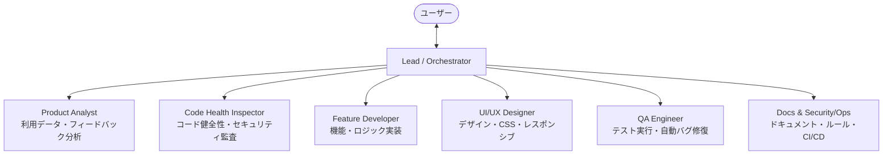

# GTA5 Mechanic Calculator - マルチサブエージェント体制マニュアル

本リポジトリは、オーケストレーター集約型のマルチサブエージェント体制で開発・保守されています。

## チーム体制図

## サブエージェント一覧

| エージェント名 | タイプ名 | 推奨モデル | 権限 | 主な役割 |
| :--- | :--- | :--- | :--- | :--- |
| **Product Analyst** | `product-analyst` | `flash` | Read-only | 店舗設定プリセット、フィードバック、利用動向の分析 |
| **Code Health Inspector** | `code-inspector` | `flash` | Read-only | Git履歴、コード重複、セキュリティ・アーキテクチャ監査 |
| **Feature Developer** | `feature-developer` | `inherit`/`pro` | Read/Write | 計算ロジック、各画面機能の実装 |
| **UI/UX Designer** | `ui-designer` | `flash` | Read/Write | Renard-Repairテーマ、CSS、レスポンシブ対応 |
| **QA Engineer** | `qa-engineer` | `inherit`/`pro` | Read/Write/Exec | 単体・E2Eテスト実行、qa-autofixによる自律修復 |
| **Docs & Security/Ops** | `docs-ops` | `flash` | Read/Write | README、firestore.rules、CI/CD管理 |
